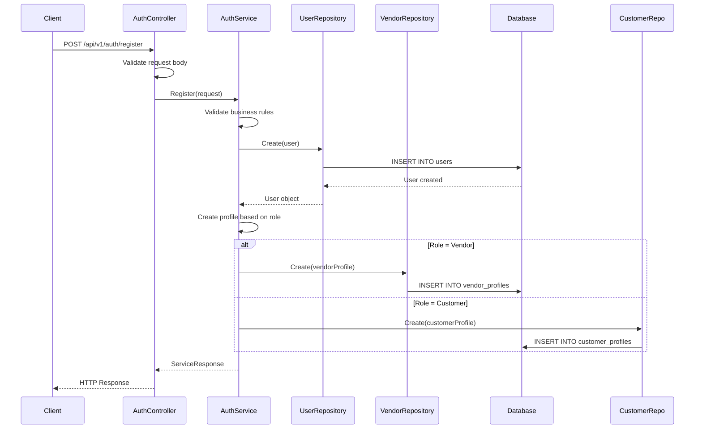
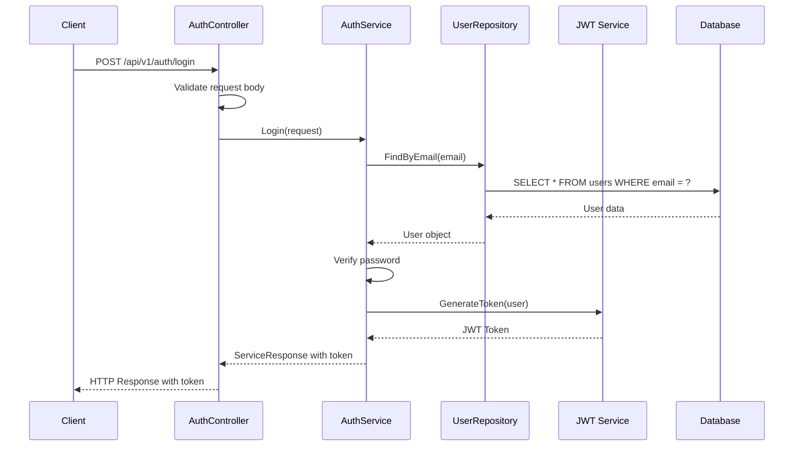
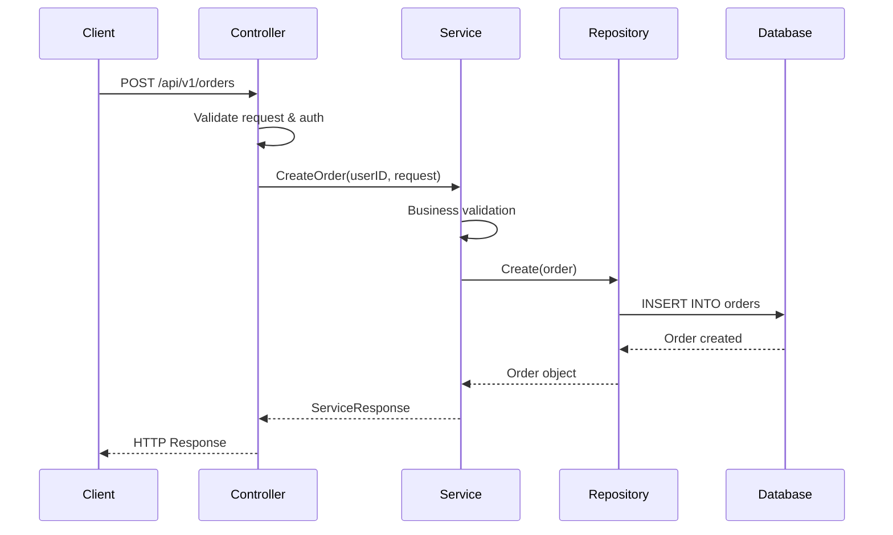
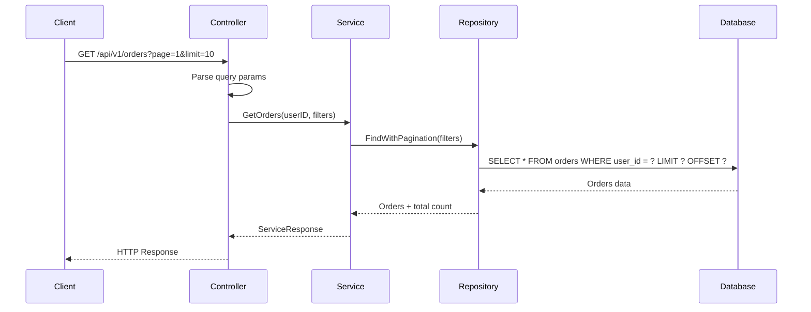
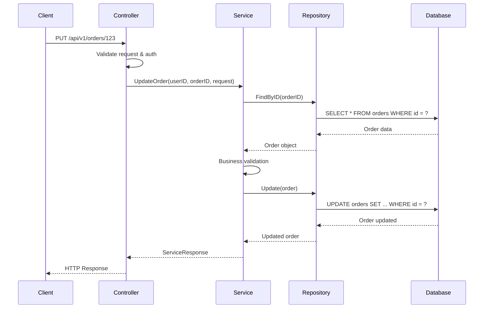
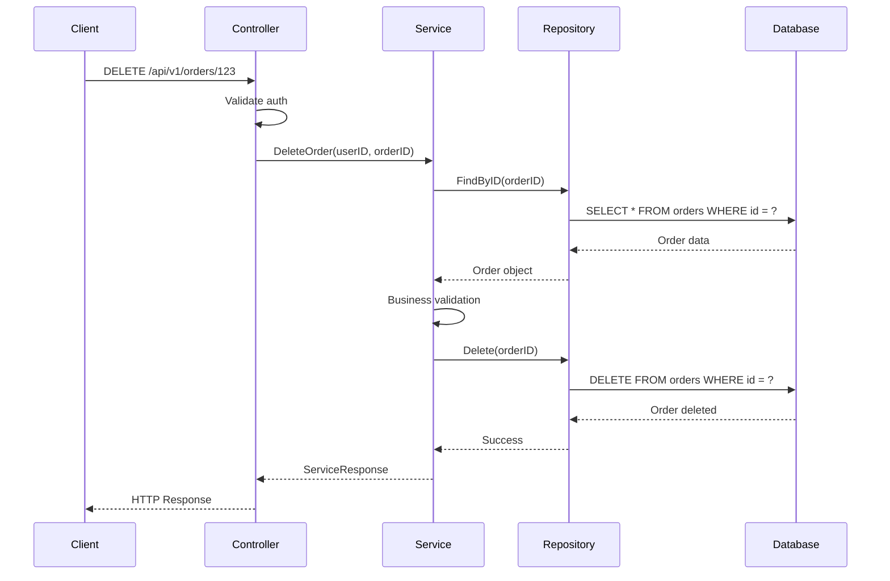

# Wedding Commerce - Architecture Pattern Documentation

## Daftar Isi

1. [Overview Arsitektur](#overview-arsitektur)
2. [Service-Repository Pattern](#service-repository-pattern)
3. [Alur Authentication (Login/Register)](#alur-authentication-loginregister)
4. [Alur CRUD Operations](#alur-crud-operations)
5. [Dependency Injection](#dependency-injection)
6. [Error Handling](#error-handling)
7. [Response Pattern](#response-pattern)
8. [Contoh Implementasi Lengkap](#contoh-implementasi-lengkap)

## Overview Arsitektur

Proyek ini menggunakan **Service-Repository Pattern** dengan **Dependency Injection** yang diimplementasikan menggunakan framework Goravel. Arsitektur ini memisahkan concerns dengan jelas:

```
Controller Layer (HTTP)
    ↓
Service Layer (Business Logic)
    ↓
Repository Layer (Data Access)
    ↓
Model Layer (Database)
```

### Komponen Utama:

- **Controllers**: Menangani HTTP requests/responses
- **Services**: Mengandung business logic
- **Repositories**: Mengelola data access
- **Models**: Representasi database entities
- **Contracts**: Interface definitions

## Service-Repository Pattern

### 1. Contract Layer (Interface Definitions)

Semua interface didefinisikan di `app/contracts/`:

```go
// app/contracts/services/user_service.go
type UserServiceInterface interface {
    BaseServiceInterface
    GetUser(id uint) (*ServiceResponse, error)
    CreateUser(request *CreateUserRequest) (*ServiceResponse, error)
    UpdateUser(id uint, request *UpdateUserRequest) (*ServiceResponse, error)
    DeleteUser(id uint) (*ServiceResponse, error)
}

// app/contracts/repositories/user_repository.go
type UserRepositoryInterface interface {
    BaseRepositoryInterface[models.User]
    FindByEmail(email string) (*models.User, error)
    FindByRole(role string) ([]*models.User, error)
}
```

### 2. Service Layer (Business Logic)

Implementasi business logic di `app/services/`:

```go
// app/services/user_service.go
type UserService struct {
    userRepo repositories.UserRepositoryInterface
}

func NewUserService(userRepo repositories.UserRepositoryInterface) services.UserServiceInterface {
    return &UserService{
        userRepo: userRepo,
    }
}

func (s *UserService) CreateUser(request *services.CreateUserRequest) (*services.ServiceResponse, error) {
    // Business logic validation
    if request.Email == "" {
        return services.NewErrorResponse("Email is required", nil), nil
    }

    // Create user model
    user := &models.User{
        Name:     request.Name,
        Email:    request.Email,
        Password: request.Password,
        Role:     request.Role,
    }

    // Save via repository
    if err := s.userRepo.Create(user); err != nil {
        return services.NewErrorResponse("Failed to create user", err), nil
    }

    return services.NewSuccessResponse("User created successfully", user), nil
}
```

### 3. Repository Layer (Data Access)

Implementasi data access di `app/repositories/`:

```go
// app/repositories/user_repository.go
type UserRepository struct {
    db *gorm.DB
}

func (r *UserRepository) Create(user *models.User) error {
    return r.db.Create(user).Error
}

func (r *UserRepository) FindByID(id uint) (*models.User, error) {
    var user models.User
    err := r.db.First(&user, id).Error
    return &user, err
}
```

### 4. Controller Layer (HTTP Handler)

Menangani HTTP requests di `app/http/controllers/`:

```go
// app/http/controllers/user_controller.go
type UserController struct {
    userService services.UserServiceInterface
}

func NewUserController(userService services.UserServiceInterface) *UserController {
    return &UserController{
        userService: userService,
    }
}

func (c *UserController) CreateUser(ctx *gin.Context) {
    var request services.CreateUserRequest
    if err := ctx.ShouldBindJSON(&request); err != nil {
        ctx.JSON(400, gin.H{"error": err.Error()})
        return
    }

    response, err := c.userService.CreateUser(&request)
    if err != nil {
        ctx.JSON(500, gin.H{"error": err.Error()})
        return
    }

    if response.Success {
        ctx.JSON(201, response)
    } else {
        ctx.JSON(400, response)
    }
}
```

## Alur Authentication (Login/Register)

### 1. Register Process



**Implementasi Register:**

```go
// 1. Controller menerima request
func (c *AuthController) Register(ctx *gin.Context) {
    var request services.RegisterRequest
    if err := ctx.ShouldBindJSON(&request); err != nil {
        ctx.JSON(400, gin.H{"error": err.Error()})
        return
    }

    response, err := c.authService.Register(&request)
    if err != nil {
        ctx.JSON(500, gin.H{"error": err.Error()})
        return
    }

    if response.Success {
        ctx.JSON(201, response)
    } else {
        ctx.JSON(400, response)
    }
}

// 2. Service memproses business logic
func (s *AuthService) Register(request *services.RegisterRequest) (*services.ServiceResponse, error) {
    // Validasi input
    if request.Email == "" || request.Password == "" {
        return services.NewErrorResponse("Email dan password harus diisi", nil), nil
    }

    // Cek apakah email sudah ada
    existingUser, _ := s.userRepo.FindByEmail(request.Email)
    if existingUser != nil {
        return services.NewErrorResponse("Email sudah terdaftar", nil), nil
    }

    // Hash password
    hashedPassword, err := facades.Hash().Make(request.Password)
    if err != nil {
        return services.NewErrorResponse("Gagal hash password", err), nil
    }

    // Buat user
    user := &models.User{
        Name:     request.Name,
        Email:    request.Email,
        Password: hashedPassword,
        Role:     request.Role,
        IsActive: true,
    }

    if err := s.userRepo.Create(user); err != nil {
        return services.NewErrorResponse("Gagal membuat akun", err), nil
    }

    // Buat profile berdasarkan role
    switch request.Role {
    case models.RoleVendor:
        vendorProfile := &models.VendorProfile{
            UserID:       user.ID,
            BusinessName: user.Name + " Business",
            BusinessType: models.BusinessTypePersonal,
            IsActive:     true,
        }
        if err := s.vendorRepo.Create(vendorProfile); err != nil {
            facades.Log().Error("Failed to create vendor profile: " + err.Error())
        }
    case models.RoleCustomer:
        customerProfile := &models.CustomerProfile{
            UserID:   user.ID,
            FullName: user.Name,
            Phone:    &user.Phone,
            IsActive: true,
        }
        if err := s.customerRepo.Create(customerProfile); err != nil {
            facades.Log().Error("Failed to create customer profile: " + err.Error())
        }
    }

    return services.NewSuccessResponse("Registrasi berhasil", map[string]interface{}{
        "id":    user.ID,
        "name":  user.Name,
        "email": user.Email,
        "role":  user.Role,
    }), nil
}
```

### 2. Login Process



**Implementasi Login:**

```go
func (s *AuthService) Login(request *services.LoginRequest) (*services.ServiceResponse, error) {
    // Validasi input
    if request.Email == "" || request.Password == "" {
        return services.NewErrorResponse("Email dan password harus diisi", nil), nil
    }

    // Cari user berdasarkan email
    user, err := s.userRepo.FindByEmail(request.Email)
    if err != nil {
        return services.NewErrorResponse("Email atau password salah", nil), nil
    }

    // Verifikasi password
    if !facades.Hash().Check(request.Password, user.Password) {
        return services.NewErrorResponse("Email atau password salah", nil), nil
    }

    // Cek status aktif
    if !user.IsActive {
        return services.NewErrorResponse("Akun tidak aktif", nil), nil
    }

    // Generate JWT token
    token, err := facades.Jwt().Make(map[string]interface{}{
        "id":    user.ID,
        "email": user.Email,
        "role":  user.Role,
    })
    if err != nil {
        return services.NewErrorResponse("Gagal generate token", err), nil
    }

    return services.NewSuccessResponse("Login berhasil", map[string]interface{}{
        "token": token,
        "user": map[string]interface{}{
            "id":    user.ID,
            "name":  user.Name,
            "email": user.Email,
            "role":  user.Role,
        },
    }), nil
}
```

## Alur CRUD Operations

### 1. Create Operation



**Contoh Create Order:**

```go
// Controller
func (c *OrderController) CreateOrder(ctx *gin.Context) {
    user := ctx.MustGet("user").(*models.User)

    var request services.CreateOrderRequest
    if err := ctx.ShouldBindJSON(&request); err != nil {
        ctx.JSON(400, gin.H{"error": err.Error()})
        return
    }

    response, err := c.orderService.CreateOrder(user.ID, &request)
    if err != nil {
        ctx.JSON(500, gin.H{"error": err.Error()})
        return
    }

    if response.Success {
        ctx.JSON(201, response)
    } else {
        ctx.JSON(400, response)
    }
}

// Service
func (s *OrderService) CreateOrder(userID uint, request *services.CreateOrderRequest) (*services.ServiceResponse, error) {
    // Validasi business rules
    if request.ServiceID == 0 {
        return services.NewErrorResponse("Service ID harus diisi", nil), nil
    }

    // Cek apakah service ada
    service, err := s.serviceRepo.FindByID(request.ServiceID)
    if err != nil {
        return services.NewErrorResponse("Service tidak ditemukan", err), nil
    }

    // Buat order
    order := &models.Order{
        UserID:      userID,
        ServiceID:   request.ServiceID,
        VendorID:    service.VendorID,
        Quantity:    request.Quantity,
        TotalPrice:  service.Price * request.Quantity,
        Status:      models.OrderStatusPending,
        OrderDate:   time.Now(),
    }

    if err := s.orderRepo.Create(order); err != nil {
        return services.NewErrorResponse("Gagal membuat order", err), nil
    }

    return services.NewSuccessResponse("Order berhasil dibuat", order), nil
}
```

### 2. Read Operation (Get All)



**Contoh Get Orders:**

```go
// Controller
func (c *OrderController) GetOrders(ctx *gin.Context) {
    user := ctx.MustGet("user").(*models.User)

    // Parse query parameters
    page, _ := strconv.Atoi(ctx.DefaultQuery("page", "1"))
    limit, _ := strconv.Atoi(ctx.DefaultQuery("limit", "10"))

    filters := &services.OrderFilters{
        Status: ctx.Query("status"),
    }

    response, err := c.orderService.GetOrders(user.ID, filters, page, limit)
    if err != nil {
        ctx.JSON(500, gin.H{"error": err.Error()})
        return
    }

    ctx.JSON(200, response)
}

// Service
func (s *OrderService) GetOrders(userID uint, filters *services.OrderFilters, page, limit int) (*services.ServiceResponse, error) {
    orders, total, err := s.orderRepo.FindWithPagination(userID, filters, page, limit)
    if err != nil {
        return services.NewErrorResponse("Gagal mengambil orders", err), nil
    }

    return services.NewSuccessResponse("Orders berhasil diambil", map[string]interface{}{
        "orders": orders,
        "pagination": map[string]interface{}{
            "page":       page,
            "limit":      limit,
            "total":      total,
            "total_pages": int(math.Ceil(float64(total) / float64(limit))),
        },
    }), nil
}
```

### 3. Update Operation



**Contoh Update Order:**

```go
// Controller
func (c *OrderController) UpdateOrder(ctx *gin.Context) {
    user := ctx.MustGet("user").(*models.User)
    orderID := ctx.Param("id")

    var request services.UpdateOrderRequest
    if err := ctx.ShouldBindJSON(&request); err != nil {
        ctx.JSON(400, gin.H{"error": err.Error()})
        return
    }

    orderIDUint, err := strconv.ParseUint(orderID, 10, 32)
    if err != nil {
        ctx.JSON(400, gin.H{"error": "Invalid order ID"})
        return
    }

    response, err := c.orderService.UpdateOrder(user.ID, uint(orderIDUint), &request)
    if err != nil {
        ctx.JSON(500, gin.H{"error": err.Error()})
        return
    }

    if response.Success {
        ctx.JSON(200, response)
    } else {
        ctx.JSON(400, response)
    }
}

// Service
func (s *OrderService) UpdateOrder(userID, orderID uint, request *services.UpdateOrderRequest) (*services.ServiceResponse, error) {
    // Cari order
    order, err := s.orderRepo.FindByID(orderID)
    if err != nil {
        return services.NewErrorResponse("Order tidak ditemukan", err), nil
    }

    // Cek ownership
    if order.UserID != userID {
        return services.NewErrorResponse("Tidak memiliki akses ke order ini", nil), nil
    }

    // Validasi status
    if order.Status != models.OrderStatusPending {
        return services.NewErrorResponse("Order tidak dapat diubah", nil), nil
    }

    // Update order
    order.Quantity = request.Quantity
    order.Notes = request.Notes

    if err := s.orderRepo.Update(order); err != nil {
        return services.NewErrorResponse("Gagal mengupdate order", err), nil
    }

    return services.NewSuccessResponse("Order berhasil diupdate", order), nil
}
```

### 4. Delete Operation



**Contoh Delete Order:**

```go
// Controller
func (c *OrderController) DeleteOrder(ctx *gin.Context) {
    user := ctx.MustGet("user").(*models.User)
    orderID := ctx.Param("id")

    orderIDUint, err := strconv.ParseUint(orderID, 10, 32)
    if err != nil {
        ctx.JSON(400, gin.H{"error": "Invalid order ID"})
        return
    }

    response, err := c.orderService.DeleteOrder(user.ID, uint(orderIDUint))
    if err != nil {
        ctx.JSON(500, gin.H{"error": err.Error()})
        return
    }

    if response.Success {
        ctx.JSON(200, response)
    } else {
        ctx.JSON(400, response)
    }
}

// Service
func (s *OrderService) DeleteOrder(userID, orderID uint) (*services.ServiceResponse, error) {
    // Cari order
    order, err := s.orderRepo.FindByID(orderID)
    if err != nil {
        return services.NewErrorResponse("Order tidak ditemukan", err), nil
    }

    // Cek ownership
    if order.UserID != userID {
        return services.NewErrorResponse("Tidak memiliki akses ke order ini", nil), nil
    }

    // Validasi status
    if order.Status != models.OrderStatusPending {
        return services.NewErrorResponse("Order tidak dapat dihapus", nil), nil
    }

    // Delete order
    if err := s.orderRepo.Delete(orderID); err != nil {
        return services.NewErrorResponse("Gagal menghapus order", err), nil
    }

    return services.NewSuccessResponse("Order berhasil dihapus", nil), nil
}
```

## Dependency Injection

### 1. Service Provider Registration

```go
// app/providers/app_service_provider.go
func (receiver *AppServiceProvider) Register(app foundation.Application) {
    // Repository bindings
    app.Bind("repositories.UserRepositoryInterface", func(app foundation.Application) (any, error) {
        return repositories.NewUserRepository(), nil
    })

    app.Bind("repositories.OrderRepositoryInterface", func(app foundation.Application) (any, error) {
        return repositories.NewOrderRepository(), nil
    })

    // Service bindings
    app.Bind("services.UserServiceInterface", func(app foundation.Application) (any, error) {
        userRepo := app.Make("repositories.UserRepositoryInterface").(repositories.UserRepositoryInterface)
        return services.NewUserService(userRepo), nil
    })

    app.Bind("services.OrderServiceInterface", func(app foundation.Application) (any, error) {
        orderRepo := app.Make("repositories.OrderRepositoryInterface").(repositories.OrderRepositoryInterface)
        userRepo := app.Make("repositories.UserRepositoryInterface").(repositories.UserRepositoryInterface)
        return services.NewOrderService(orderRepo, userRepo), nil
    })
}
```

### 2. Controller Initialization

```go
// routes/api.go
func Api() {
    // Get service instances via DI
    userServiceInterface, _ := facades.App().Make("services.UserServiceInterface")
    userService := userServiceInterface.(services.UserServiceInterface)

    orderServiceInterface, _ := facades.App().Make("services.OrderServiceInterface")
    orderService := orderServiceInterface.(services.OrderServiceInterface)

    // Initialize controllers with dependencies
    userController := controllers.NewUserController(userService)
    orderController := controllers.NewOrderController(orderService)

    // Define routes
    api := facades.Route().Prefix("api/v1")
    api.Middleware(middleware.Auth()).Get("/orders", orderController.GetOrders)
    api.Middleware(middleware.Auth()).Post("/orders", orderController.CreateOrder)
}
```

## Error Handling

### 1. Service Response Pattern

```go
// app/contracts/services/base_service.go
type ServiceResponse struct {
    Success bool        `json:"success"`
    Message string      `json:"message"`
    Data    interface{} `json:"data,omitempty"`
    Error   error       `json:"error,omitempty"`
}

func NewSuccessResponse(message string, data interface{}) *ServiceResponse {
    return &ServiceResponse{
        Success: true,
        Message: message,
        Data:    data,
    }
}

func NewErrorResponse(message string, err error) *ServiceResponse {
    return &ServiceResponse{
        Success: false,
        Message: message,
        Error:   err,
    }
}
```

### 2. Error Handling di Controller

```go
func (c *OrderController) CreateOrder(ctx *gin.Context) {
    // Validasi input
    var request services.CreateOrderRequest
    if err := ctx.ShouldBindJSON(&request); err != nil {
        ctx.JSON(400, gin.H{
            "success": false,
            "message": "Invalid request format",
            "error":   err.Error(),
        })
        return
    }

    // Panggil service
    response, err := c.orderService.CreateOrder(user.ID, &request)
    if err != nil {
        ctx.JSON(500, gin.H{
            "success": false,
            "message": "Internal server error",
            "error":   err.Error(),
        })
        return
    }

    // Return response berdasarkan success status
    if response.Success {
        ctx.JSON(201, response)
    } else {
        ctx.JSON(400, response)
    }
}
```

### 3. Error Handling di Service

```go
func (s *OrderService) CreateOrder(userID uint, request *services.CreateOrderRequest) (*services.ServiceResponse, error) {
    // Validasi business rules
    if request.ServiceID == 0 {
        return services.NewErrorResponse("Service ID harus diisi", nil), nil
    }

    // Cek apakah service ada
    service, err := s.serviceRepo.FindByID(request.ServiceID)
    if err != nil {
        if errors.Is(err, gorm.ErrRecordNotFound) {
            return services.NewErrorResponse("Service tidak ditemukan", nil), nil
        }
        return services.NewErrorResponse("Gagal mengambil data service", err), nil
    }

    // Business logic lainnya...

    return services.NewSuccessResponse("Order berhasil dibuat", order), nil
}
```

## Response Pattern

### 1. Success Response

```json
{
  "success": true,
  "message": "Order berhasil dibuat",
  "data": {
    "id": 1,
    "user_id": 123,
    "service_id": 456,
    "quantity": 2,
    "total_price": 1000000,
    "status": "pending",
    "order_date": "2024-01-15T10:30:00Z"
  }
}
```

### 2. Error Response

```json
{
  "success": false,
  "message": "Service tidak ditemukan",
  "error": "record not found"
}
```

### 3. Pagination Response

```json
{
    "success": true,
    "message": "Orders berhasil diambil",
    "data": {
        "orders": [...],
        "pagination": {
            "page": 1,
            "limit": 10,
            "total": 50,
            "total_pages": 5
        }
    }
}
```

## Contoh Implementasi Lengkap

### 1. Complete CRUD untuk Service

```go
// app/contracts/services/service_service.go
type ServiceServiceInterface interface {
    BaseServiceInterface
    GetServices(vendorID uint, filters *ServiceFilters, page, limit int) (*ServiceResponse, error)
    GetService(id uint) (*ServiceResponse, error)
    CreateService(vendorID uint, request *CreateServiceRequest) (*ServiceResponse, error)
    UpdateService(vendorID, id uint, request *UpdateServiceRequest) (*ServiceResponse, error)
    DeleteService(vendorID, id uint) (*ServiceResponse, error)
}

// app/services/service_service.go
type ServiceService struct {
    serviceRepo repositories.ServiceRepositoryInterface
    vendorRepo  repositories.VendorProfileRepositoryInterface
}

func NewServiceService(serviceRepo repositories.ServiceRepositoryInterface, vendorRepo repositories.VendorProfileRepositoryInterface) services.ServiceServiceInterface {
    return &ServiceService{
        serviceRepo: serviceRepo,
        vendorRepo:  vendorRepo,
    }
}

func (s *ServiceService) CreateService(vendorID uint, request *services.CreateServiceRequest) (*services.ServiceResponse, error) {
    // Validasi input
    if request.Name == "" {
        return services.NewErrorResponse("Nama service harus diisi", nil), nil
    }

    if request.Price <= 0 {
        return services.NewErrorResponse("Harga harus lebih dari 0", nil), nil
    }

    // Cek apakah vendor ada
    vendor, err := s.vendorRepo.FindByUserID(vendorID)
    if err != nil {
        return services.NewErrorResponse("Vendor tidak ditemukan", err), nil
    }

    // Buat service
    service := &models.Service{
        VendorID:    vendor.ID,
        Name:        request.Name,
        Description: request.Description,
        Price:       request.Price,
        Category:    request.Category,
        IsActive:    true,
    }

    if err := s.serviceRepo.Create(service); err != nil {
        return services.NewErrorResponse("Gagal membuat service", err), nil
    }

    return services.NewSuccessResponse("Service berhasil dibuat", service), nil
}

func (s *ServiceService) GetServices(vendorID uint, filters *services.ServiceFilters, page, limit int) (*services.ServiceResponse, error) {
    services, total, err := s.serviceRepo.FindByVendorWithPagination(vendorID, filters, page, limit)
    if err != nil {
        return services.NewErrorResponse("Gagal mengambil services", err), nil
    }

    return services.NewSuccessResponse("Services berhasil diambil", map[string]interface{}{
        "services": services,
        "pagination": map[string]interface{}{
            "page":        page,
            "limit":       limit,
            "total":       total,
            "total_pages": int(math.Ceil(float64(total) / float64(limit))),
        },
    }), nil
}

func (s *ServiceService) UpdateService(vendorID, id uint, request *services.UpdateServiceRequest) (*services.ServiceResponse, error) {
    // Cari service
    service, err := s.serviceRepo.FindByID(id)
    if err != nil {
        return services.NewErrorResponse("Service tidak ditemukan", err), nil
    }

    // Cek ownership
    if service.VendorID != vendorID {
        return services.NewErrorResponse("Tidak memiliki akses ke service ini", nil), nil
    }

    // Update service
    service.Name = request.Name
    service.Description = request.Description
    service.Price = request.Price
    service.Category = request.Category

    if err := s.serviceRepo.Update(service); err != nil {
        return services.NewErrorResponse("Gagal mengupdate service", err), nil
    }

    return services.NewSuccessResponse("Service berhasil diupdate", service), nil
}

func (s *ServiceService) DeleteService(vendorID, id uint) (*services.ServiceResponse, error) {
    // Cari service
    service, err := s.serviceRepo.FindByID(id)
    if err != nil {
        return services.NewErrorResponse("Service tidak ditemukan", err), nil
    }

    // Cek ownership
    if service.VendorID != vendorID {
        return services.NewErrorResponse("Tidak memiliki akses ke service ini", nil), nil
    }

    // Soft delete
    service.IsActive = false
    if err := s.serviceRepo.Update(service); err != nil {
        return services.NewErrorResponse("Gagal menghapus service", err), nil
    }

    return services.NewSuccessResponse("Service berhasil dihapus", nil), nil
}
```

### 2. Complete Controller Implementation

```go
// app/http/controllers/service_controller.go
type ServiceController struct {
    serviceService services.ServiceServiceInterface
}

func NewServiceController(serviceService services.ServiceServiceInterface) *ServiceController {
    return &ServiceController{
        serviceService: serviceService,
    }
}

func (c *ServiceController) GetServices(ctx *gin.Context) {
    user := ctx.MustGet("user").(*models.User)

    // Parse query parameters
    page, _ := strconv.Atoi(ctx.DefaultQuery("page", "1"))
    limit, _ := strconv.Atoi(ctx.DefaultQuery("limit", "10"))

    filters := &services.ServiceFilters{
        Category: ctx.Query("category"),
        IsActive: true,
    }

    response, err := c.serviceService.GetServices(user.ID, filters, page, limit)
    if err != nil {
        ctx.JSON(500, gin.H{"error": err.Error()})
        return
    }

    ctx.JSON(200, response)
}

func (c *ServiceController) CreateService(ctx *gin.Context) {
    user := ctx.MustGet("user").(*models.User)

    var request services.CreateServiceRequest
    if err := ctx.ShouldBindJSON(&request); err != nil {
        ctx.JSON(400, gin.H{"error": err.Error()})
        return
    }

    response, err := c.serviceService.CreateService(user.ID, &request)
    if err != nil {
        ctx.JSON(500, gin.H{"error": err.Error()})
        return
    }

    if response.Success {
        ctx.JSON(201, response)
    } else {
        ctx.JSON(400, response)
    }
}

func (c *ServiceController) UpdateService(ctx *gin.Context) {
    user := ctx.MustGet("user").(*models.User)
    serviceID := ctx.Param("id")

    var request services.UpdateServiceRequest
    if err := ctx.ShouldBindJSON(&request); err != nil {
        ctx.JSON(400, gin.H{"error": err.Error()})
        return
    }

    serviceIDUint, err := strconv.ParseUint(serviceID, 10, 32)
    if err != nil {
        ctx.JSON(400, gin.H{"error": "Invalid service ID"})
        return
    }

    response, err := c.serviceService.UpdateService(user.ID, uint(serviceIDUint), &request)
    if err != nil {
        ctx.JSON(500, gin.H{"error": err.Error()})
        return
    }

    if response.Success {
        ctx.JSON(200, response)
    } else {
        ctx.JSON(400, response)
    }
}

func (c *ServiceController) DeleteService(ctx *gin.Context) {
    user := ctx.MustGet("user").(*models.User)
    serviceID := ctx.Param("id")

    serviceIDUint, err := strconv.ParseUint(serviceID, 10, 32)
    if err != nil {
        ctx.JSON(400, gin.H{"error": "Invalid service ID"})
        return
    }

    response, err := c.serviceService.DeleteService(user.ID, uint(serviceIDUint))
    if err != nil {
        ctx.JSON(500, gin.H{"error": err.Error()})
        return
    }

    if response.Success {
        ctx.JSON(200, response)
    } else {
        ctx.JSON(400, response)
    }
}
```

## Kesimpulan

Pattern yang digunakan dalam proyek ini memberikan:

1. **Separation of Concerns**: Setiap layer memiliki tanggung jawab yang jelas
2. **Testability**: Mudah untuk unit testing karena dependency injection
3. **Maintainability**: Kode mudah dipelihara dan dikembangkan
4. **Scalability**: Mudah menambah fitur baru tanpa mengubah kode existing
5. **Consistency**: Pattern yang konsisten di seluruh aplikasi

Dengan pattern ini, pengembangan aplikasi menjadi lebih terstruktur dan mudah dipahami oleh tim development.
